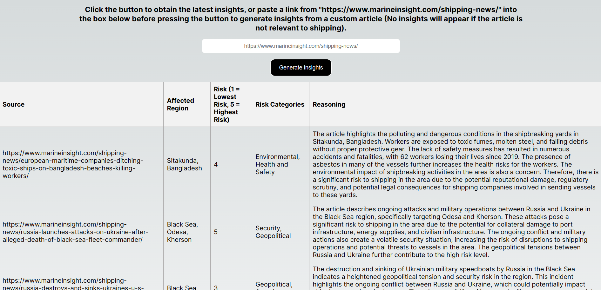

## About

[GeoShield](https://geoshield.vercel.app/) leverages Large Language Model technology to scan for global supply chain disruptions and parse them into quantitative metrics for stakeholders.

## Learn More

- [Presentation slides](https://sitsingaporetechedu-my.sharepoint.com/:b:/r/personal/2000603_sit_singaporetech_edu_sg/Documents/PSA%20Hackathon/Slides_SolverHub.pdf?csf=1&web=1&e=0YaKT3)